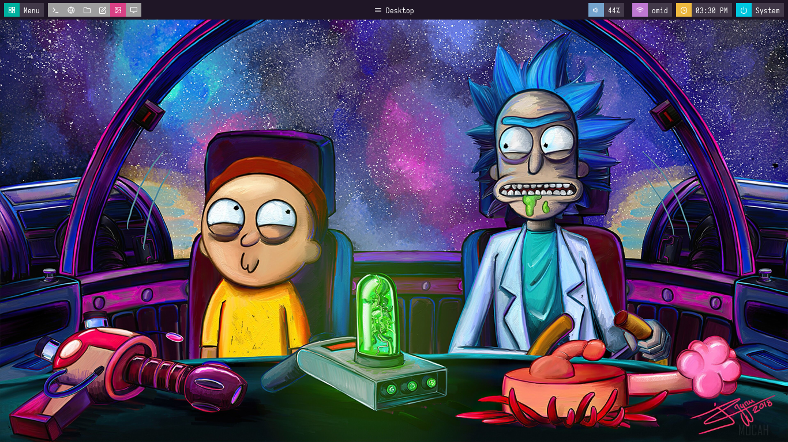
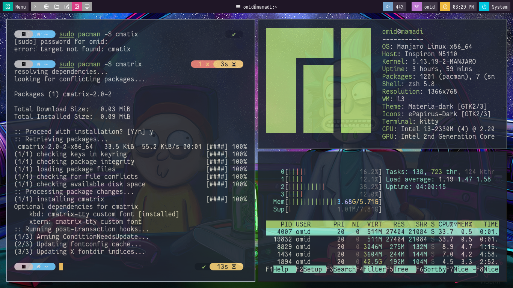

# MY DOTFILES
Desktop

Multiple Winodw Open             | Noevim
:-------------------------:|:-------------------------:
 | 

* Distro: Manjaro
* Tilling WM: i3
* Text Editor: Neovim
* Terminal: Kitty

you can use my [neovim](https://github.com/techwithomid/neovim-conf) config.
